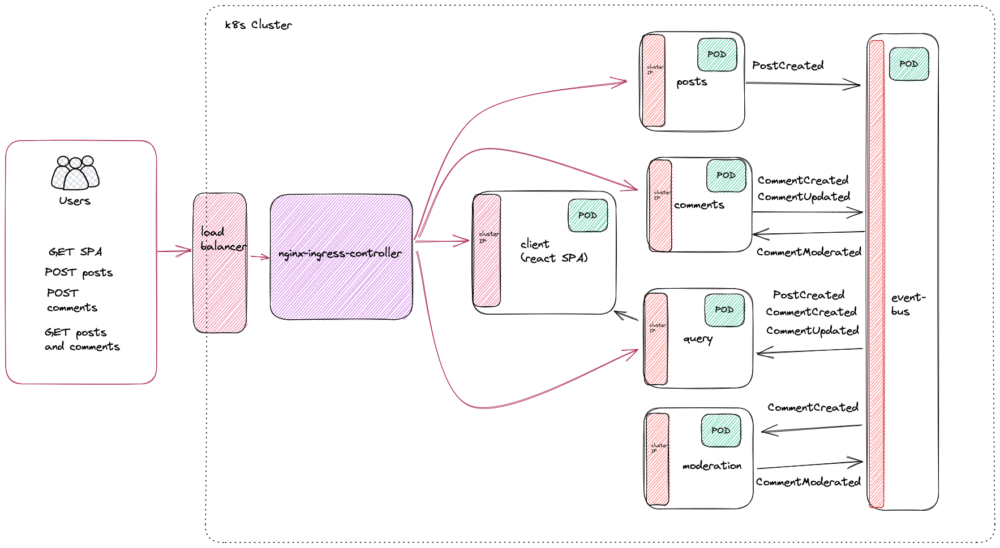

# Microservices with Node and React - Simple Blog App

## Overview

[Course](https://www.udemy.com/course/microservices-with-node-js-and-react/)

A simple microservice based blog app demonstrating the following concepts:

- Async communication with an event bus
- Data models between services
- Service packaging with `docker`
- Service orchestration with `kubernetes`
- Local kubernetes dev with `skaffold`

## Service architecture

See the following diagram for an overview



Note: all data is in memory

### Posts service

Posts service allows POSTing of posts. Following is an example **request** body to the posts service:

`POST http://posts.com/posts/create`

```json
{
  "title": "hello?"
}
```

### Comments service

Comments service allows POSTing of comments. Following is an example **request** body to the comments service. Note that association to a post in the url.

`POST http://posts.com/posts/078e8452/comments`

```json
{
  "title": "hello?"
}
```

The comments service also handles events from the moderation service to update comments that have been updated or rejected. Following is an example event flow:

```text
[comments] {
[comments]   type: 'CommentCreated',
[comments]   data: {
[comments]     id: 'd7c383be',
[comments]     content: 'is moderation up?',
[comments]     status: 'pending',
[comments]     postId: '078e8452'
[comments]   }
[comments] }

[moderation]{
[moderation]   id: 'd7c383be',
[moderation]   content: 'is moderation up?',
[moderation]   status: 'approved',
[moderation]   postId: '078e8452'
[moderation] }


[comments] {
[comments]   type: 'CommentModerated',
[comments]   data: {
[comments]     id: 'd7c383be',
[comments]     content: 'is moderation up?',
[comments]     status: 'approved',
[comments]     postId: '078e8452'
[comments]   }
[comments] }
```

### Query service

Query service listens for post and comment update events. It then aggregates the data for frontend clients. Following is an example response from the query service:

```json
{
  "078e8452": {
    "id": "078e8452",
    "title": "hello",
    "comments": [
      {
        "id": "b7f17d54",
        "content": "I said hello!",
        "status": "approved",
        "postId": "078e8452"
      }
    ]
  },
  "41092c7f": {
    "id": "41092c7f",
    "title": "jello",
    "comments": [
      {
        "id": "929ad397",
        "content": "I said jello!",
        "status": "approved",
        "postId": "41092c7f"
      }
    ]
  }
}
```

## The event bus

A very simple express based HTTP event bus was written for demonstration purposes. It simply accepts POST request for events, and then publishes the event to all other services. Additionally, it persists all events in memory for retrieval after downtime, as demonstrated in the query service.
